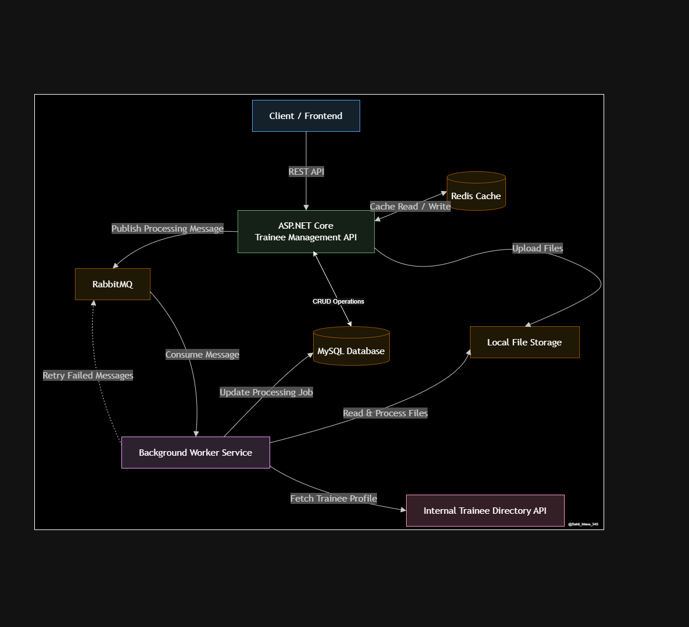

# Trainee Management System

A robust ASP.NET Core Web API for managing trainees, mentors, learning tasks, submissions, and reviews. The API provides JWT authentication, Redis caching, RabbitMQ background processing, health checks, and Swagger documentation.

---

# Features

- JWT Authentication
- Role-Based Authorization
- Trainee Management
- Mentor Management
- Learning Task Management
- Task Assignment Management
- Submission Management
- File Upload Support
- Review Management
- Background Processing with RabbitMQ
- Redis Caching
- Health Checks
- Global Exception Handling
- OpenAPI / Swagger Documentation

---

# Tech Stack

| Category | Technology |
|----------|------------|
| Framework | ASP.NET Core 9 |
| Language | C# |
| ORM | Entity Framework Core |
| Database | MySQL |
| Cache | Redis |
| Message Broker | RabbitMQ |
| Authentication | JWT Bearer |
| API Documentation | OpenAPI / Swagger |
| Containerization | Docker |

---


# Prerequisites

Before running the application, install the following:

- .NET 9 SDK
- MySQL Server
- Docker Desktop
- Entity Framework Core CLI

Install the EF Core CLI if it is not already installed.

```bash
dotnet tool install --global dotnet-ef
```

---

# Configuration

Update the `appsettings.json` file.

```json
{
  "ConnectionStrings": {
    "DefaultConnection": "Server=localhost;Port=3306;Database=<database>;User ID=<username>;Password=<password>;",
    "RedisConnection" : "localhost:6379"
  },
  "JWT": {
    "Key": "<256-bit-secret>",
    "Issuer": "<issuer>",
    "Audience": "<audience>",
    "ExpiresIn": 3600000
  },
  "FilePaths": {
    "SubmissionFilePath" : ""
  },
  "RabbitMQ": {
    "HostName": "<localhost>",
    "Port": <PORT>,
    "UserName": <username>,
    "Password": <password>,
    "VirtualHost": <VirtualHostRoute>
  }
}
```

---

# Running Infrastructure Services

Start Redis and RabbitMQ.

```bash
docker compose up -d
```

| Service | URL / Port |
|---------|------------|
| Redis | localhost:6379 |
| RabbitMQ | localhost:5672 |
| RabbitMQ Management | http://localhost:15672 |

Default RabbitMQ Credentials

| Username | Password |
|----------|----------|
| admin | admin |

---

# Build the Project

Restore all NuGet packages.

```bash
dotnet restore
```

Build the project.

```bash
dotnet build
```

---

# Database Migration

Apply all pending Entity Framework migrations.

```bash
dotnet ef database update
```

---

# Run the Application

Run normally.

```bash
dotnet run --launch-profile https
```

Run with hot reload.

```bash
dotnet watch --launch-profile https
```

---

# Authentication

The application uses JWT Bearer Authentication.

An administrator account is automatically seeded when the application starts for the first time.

## Login

**Endpoint**

```http
POST /api/user/login
```

**Request Body**

```json
{
  "username": "admin",
  "password": "Admin@123456"
}
```

**Success Response**

```json
{
  "token": "",
  "expiresIn": <time in milliseconds>,
  "user": {
    "id": "",
    "userName": "",
    "role": ""
  }
}
```

Use the returned JWT token in the Authorization header.

```text
Authorization: Bearer <jwt-token>
```

---

# Standard API Response

All API endpoints return a consistent response structure.

## Success Response

```json
{
  "status": true,
  "message": "Operation completed successfully.",
  "data": {}
}
```

### Response Fields

| Field | Type | Description |
|-------|------|-------------|
| `status` | `boolean` | Indicates whether the request was successful. |
| `message` | `string` | Human-readable response message. |
| `data` | `object \| array \| null` | Contains the requested resource or result. |

---

## Error Response

For validation, the API returns the following format.

```json
{
  "type": "",
  "title": "One or more validation errors occurred.",
  "status": 400,
  "errors": {
    "field": [""]
  },
  "traceId": ""
}
```
For business logic, or unexpected errors, the API returns the following format.

```json
{
  "status": <Status code>,
  "detail": "",
  "instance": "",
  "traceId": "",
  "timestamp": "",
  "exceptionType": ""
}
```


### Error Response Fields

| Field | Type | Description |
|-------|------|-------------|
| `status` | `boolean` | Indicates the request failed. |
| `message` | `string` | Error summary. |
| `errors` | `array` | Collection of validation or business errors. |

---

# Entity Documentation

## Trainee

Represents a trainee enrolled in the learning management system.

| Field | Type | Required | Description |
|-------|------|----------|-------------|
| `id` | `Guid` | Auto Generated | Unique identifier of the trainee. |
| `firstName` | `string` | Yes | First name (3-50 characters). |
| `lastName` | `string` | Yes | Last name (3-50 characters). |
| `email` | `string` | Yes | Unique email address. |
| `techStack` | `string` | Yes | Primary technology stack. |
| `status` | `enum` | Yes | `Active`, `Inactive`, or `Completed`. |
| `createdAt` | `DateTime` | Auto Generated | Record creation timestamp. |
| `updatedAt` | `DateTime` | Auto Generated | Last modification timestamp. |

---

## Mentor

Represents a mentor responsible for reviewing trainee submissions.

| Field | Type | Required | Description |
|-------|------|----------|-------------|
| `id` | `Guid` | Auto Generated | Unique identifier. |
| `name` | `string` | Yes | Mentor name. |
| `email` | `string` | Yes | Unique email address. |
| `techStack` | `string` | Yes | Area of expertise. |
| `createdAt` | `DateTime` | Auto Generated | Creation timestamp. |
| `updatedAt` | `DateTime` | Auto Generated | Last modification timestamp. |

---

## Learning Task

Represents an assignment that can be assigned to trainees.

| Field | Type | Required | Description |
|-------|------|----------|-------------|
| `id` | `Guid` | Auto Generated | Unique identifier. |
| `title` | `string` | Yes | Learning task title. |
| `description` | `string` | Yes | Task description. |
| `deadline` | `DateTime` | Yes | Submission deadline. |
| `createdAt` | `DateTime` | Auto Generated | Creation timestamp. |

---

## Task Assignment

Represents the assignment of a learning task to a trainee.

| Field | Type | Required | Description |
|-------|------|----------|-------------|
| `id` | `Guid` | Auto Generated | Unique identifier. |
| `traineeId` | `Guid` | Yes | Assigned trainee. |
| `learningTaskId` | `Guid` | Yes | Assigned learning task. |
| `assignedAt` | `DateTime` | Auto Generated | Assignment date. |
| `dueDate` | `DateTime` | Yes | Submission deadline. |

---

## Submission

Represents a trainee submission for a learning task.

| Field | Type | Required | Description |
|-------|------|----------|-------------|
| `id` | `Guid` | Auto Generated | Unique identifier. |
| `taskAssignmentId` | `Guid` | Yes | Associated task assignment. |
| `submittedAt` | `DateTime` | Auto Generated | Submission timestamp. |
| `status` | `enum` | Yes | Pending, Processing, Completed or Failed. |

---

## Submission File

Represents an uploaded file belonging to a submission.

| Field | Type | Required | Description |
|-------|------|----------|-------------|
| `id` | `Guid` | Auto Generated | Unique identifier. |
| `submissionId` | `Guid` | Yes | Parent submission. |
| `fileName` | `string` | Yes | Original file name. |
| `contentType` | `string` | Yes | MIME type of uploaded file. |
| `fileSize` | `long` | Yes | File size in bytes. |
| `uploadedAt` | `DateTime` | Auto Generated | Upload timestamp. |

---

## Review

Represents mentor feedback for a submission.

| Field | Type | Required | Description |
|-------|------|----------|-------------|
| `id` | `Guid` | Auto Generated | Unique identifier. |
| `submissionId` | `Guid` | Yes | Reviewed submission. |
| `mentorId` | `Guid` | Yes | Reviewing mentor. |
| `remarks` | `string` | Yes | Feedback comments. |
| `rating` | `integer` | Yes | Review score. |
| `reviewedAt` | `DateTime` | Auto Generated | Review timestamp. |

---

## Processing Job

Represents an asynchronous background file processing job.

| Field | Type | Required | Description |
|-------|------|----------|-------------|
| `id` | `Guid` | Auto Generated | Unique identifier. |
| `submissionFileId` | `Guid` | Yes | Uploaded file being processed. |
| `status` | `enum` | Yes | Pending, Processing, Completed or Failed. |
| `retryCount` | `integer` | Auto Managed | Number of retry attempts. |
| `createdAt` | `DateTime` | Auto Generated | Job creation time. |
| `completedAt` | `DateTime` | Nullable | Completion time. |

---

# Validation Rules

## Trainee

| Field | Validation |
|-------|------------|
| `firstName` | Required, 3-50 characters |
| `lastName` | Required, 3-50 characters |
| `email` | Required, valid email format, unique |
| `techStack` | Required |
| `status` | Must be `Active`, `Inactive`, or `Completed` |

---

## Mentor

| Field | Validation |
|-------|------------|
| `firstName` | Required, 3-50 characters |
| `lastName` | Required, 3-50 characters |
| `email` | Required, valid email, unique |
| `expertise` | Required, 3-50 characters |
| `status` | Must be `Active`or `Inactive` |
---

## Learning Task

| Field | Validation |
|-------|------------|
| `title` | Required |
| `description` | Required |
| `expectedTechStack` | Required, 3-50 characters |
| `dueDate` | Required |
| `status` | Must be `Draft`, `Published` or `Closed`  |

---
## Task Assignment

| Field | Validation |
|-------|------------|
| `traineeId` | Required |
| `mentorId` | Required |
| `learninTaskId` | Required |
| `remarks` |  |
| `dueDate` | Required |
| `assignedDate` | Required |


---

## Review

| Field | Validation |
|-------|------------|
| `submissionId` | Required |
| `mentorId` | Required |
| `feedback` |  |
| `score` | in range of `0 - 10` |
| `status` | Must be `Accepted`, `ChangesRequired` or `Rejected`  |
---

## Submission

| Field | Validation |
|-------|------------|
| `taskAssignmentId` | Required |
| `submissionUrl` | Required, Valid URL Format |
| `notes` |  |

---

# Common HTTP Status Codes

| Status Code | Description |
|-------------|-------------|
| `200 OK` | Request completed successfully. |
| `201 Created` | Resource created successfully. |
| `204 No Content` | Resource deleted successfully. |
| `400 Bad Request` | Invalid request data. |
| `401 Unauthorized` | Authentication required or invalid token. |
| `403 Forbidden` | User is not authorized to access the resource. |
| `404 Not Found` | Requested resource does not exist. |
| `409 Conflict` | Resource already exists or business rule violation. |
| `500 Internal Server Error` | Unexpected server error occurred. |

---

# API Reference

This section describes all available REST API endpoints.

## Authentication APIs

Authenticate users and generate a JWT access token.

| Method | Endpoint | Description | Authentication |
|--------|----------|-------------|----------------|
| POST | `/api/user/login` | Authenticate user and generate JWT token | No |

### POST `/api/user/login`

Authenticates the user and returns a JWT access token.

#### Request Body

| Field | Type | Required | Description |
|-------|------|----------|-------------|
| `username` | string | Yes |  username |
| `password` | string | Yes |  password |

#### Sample Request

```json
{
  "username": "admin",
  "password": "Admin@123456"
}
```

#### Success Response

**Status Code:** `200 OK`

```json
{
  "status": true,
  "message": "Login successful.",
  "data": {
    "token": "<jwt-token>"
  }
}
```

---

# Health APIs

Used to verify application availability and dependency health.

| Method | Endpoint | Description | Authentication |
|--------|----------|-------------|----------------|
| GET | `/api/health` | Application health information | No |
| GET | `/healthz` | Health check endpoint | No |
| GET | `/swagger` | Swagger UI | No |

---

### GET `/api/health`

Returns basic application status.

#### Success Response

**Status Code:** `200 OK`

```json
{
  "status": "running",
  "application": "Trainee Management API",
  "timestamp": "2026-06-30T12:15:30"
}
```

---

### GET `/healthz`

Returns health status of configured services.

Checks include:

- MySQL
- Redis
- RabbitMQ

---

# Trainee APIs

Manage trainee information.

| Method | Endpoint | Description |
|--------|----------|-------------|
| GET | `/api/trainees` | Get all trainees |
| GET | `/api/trainees/{id}` | Get trainee by Id |
| POST | `/api/trainees` | Create trainee |
| PUT | `/api/trainees/{id}` | Update trainee |
| DELETE | `/api/trainees/{id}` | Delete trainee |

---

## GET `/api/trainees`

Returns all trainees.

### Query Parameters

| Name | Type | Required | Description |
|------|------|----------|-------------|
| `search` | string | No | Search by first name, last name, email or tech stack |
| `status` | string | No | Search by status |
| `pageNumber` | int | No | Number of Page to be taken |
| `pageSize` | int | No | Number of records in a page |

### Success Response

**Status Code:** `200 OK`

```json
{
  "success": true,
  "message": "Trainees fetched successfully.",
  "data": {
    "pageNumber": 1,
    "pageSize": 10,
    "totalRecords": 1,
    "data": [
      {
        "id": "",
        "firstName": "",
        "lastName": "",
        "email": "",
        "techStack": "",
        "status": "",
        "createdAt": "",
        "updatedAt": ""
      }
    ]
  }
}
```

---

## GET `/api/trainees/{id}`

Returns a trainee by its unique identifier.

### Path Parameters

| Name | Type | Description |
|------|------|-------------|
| `id` | Guid | Trainee identifier |

### Success Response

**Status Code:** `200 OK`

```json
{
  "status": true,
  "message": "Trainee fetched successfully.",
  "data": {
    "id": "guid",
    "firstName": "John",
    "lastName": "Doe",
    "email": "john@example.com",
    "techStack": "ASP.NET Core",
    "status": "Active"
  }
}
```

---

## POST `/api/trainees`

Creates a new trainee.

### Request Body

| Field | Type | Required | Description |
|-------|------|----------|-------------|
| `firstName` | string | Yes | First name |
| `lastName` | string | Yes | Last name |
| `email` | string | Yes | Email address |
| `techStack` | string | Yes | Technology stack |
| `status` | string | Yes | Active, Inactive or Completed |

### Sample Request

```json
{
  "firstName": "John",
  "lastName": "Doe",
  "email": "john@example.com",
  "techStack": "ASP.NET Core",
  "status": "Active"
}
```

### Success Response

**Status Code:** `201 Created`

```json
{
  "status": true,
  "message": "Trainee created successfully.",
  "data": {
    "id": "guid"
  }
}
```

---

## PUT `/api/trainees/{id}`

Updates an existing trainee.

### Path Parameters

| Name | Type | Description |
|------|------|-------------|
| `id` | Guid | Trainee identifier |

### Request Body

Same as **Create Trainee**.

### Success Response

**Status Code:** `200 OK`

```json
{
  "status": true,
  "message": "Trainee updated successfully."
}
```

---

## DELETE `/api/trainees/{id}`

Deletes a trainee.

### Path Parameters

| Name | Type | Description |
|------|------|-------------|
| `id` | Guid | Trainee identifier |

### Success Response

**Status Code:** `204 No Content`

---

# Mentor APIs

Manage mentor information.

| Method | Endpoint | Description |
|--------|----------|-------------|
| GET | `/api/mentor` | Get all mentors |
| GET | `/api/mentor/{id}` | Get mentor by Id |
| POST | `/api/mentor` | Create mentor |
| PUT | `/api/mentor/{id}` | Update mentor |
| DELETE | `/api/mentor/{id}` | Delete mentor |

---

## GET `/api/mentor`

Returns all mentors.

**Status Code:** `200 OK`

---

## GET `/api/mentor/{id}`

Returns mentor details.

### Path Parameters

| Name | Type |
|------|------|
| `id` | Guid |

---

## POST `/api/mentor`

Creates a mentor.

### Request Body

| Field | Type | Required |
|-------|------|----------|
| `firstName` | string | Yes |
| `lastName` | string | Yes |
| `email` | string | Yes |
| `expertise` | string | Yes |
| `status` | string | Yes |

**Status Code:** `201 Created`

---

## PUT `/api/mentor/{id}`

Updates mentor information.

**Status Code:** `200 OK`

---

## DELETE `/api/mentor/{id}`

Deletes a mentor.

**Status Code:** `204 No Content`

---

# Learning Task APIs

Manage learning tasks.

| Method | Endpoint | Description |
|--------|----------|-------------|
| GET | `/api/learningtask` | Get all learning tasks |
| GET | `/api/learningtask/{id}` | Get learning task |
| POST | `/api/learningtask` | Create learning task |
| PUT | `/api/learningtask/{id}` | Update learning task |
| DELETE | `/api/learningtask/{id}` | Delete learning task |

---

## GET `/api/learningtask`

Returns all learning tasks.

**Status Code:** `200 OK`

---

## GET `/api/learningtask/{id}`

Returns a learning task.

### Path Parameters

| Name | Type |
|------|------|
| `id` | Guid |

---

## POST `/api/learningtask`

Creates a learning task.

### Request Body

| Field | Type | Required |
|-------|------|----------|
| `title` | string | Yes |
| `description` | string | Yes |
| `expectedTechStack` | string | Yes |
| `status` | string | Yes |
| `dueDate` | datetime | Yes |

**Status Code:** `201 Created`

---

## PUT `/api/learningtask/{id}`

Updates an existing learning task.

**Status Code:** `200 OK`

---

## DELETE `/api/learningtask/{id}`

Deletes a learning task.

**Status Code:** `204 No Content`
---

# Task Assignment APIs

Manage assignments between trainees and learning tasks.

| Method | Endpoint | Description |
|--------|----------|-------------|
| GET | `/api/task-assignments` | Get all task assignments |
| GET | `/api/task-assignments/{id}` | Get task assignment by Id |
| POST | `/api/task-assignments` | Assign a learning task to a trainee |
| PUT | `/api/task-assignments/{id}` | Update task assignment |

---

## GET `/api/task-assignments`

Returns all task assignments.

### Success Response

**Status Code:** `200 OK`

---

## GET `/api/task-assignments/{id}`

Returns a task assignment by its unique identifier.

### Path Parameters

| Name | Type | Description |
|------|------|-------------|
| `id` | `Guid` | Task Assignment identifier |

### Success Response

**Status Code:** `200 OK`

---

## POST `/api/task-assignments`

Assigns a learning task to a trainee.

### Request Body

| Field | Type | Required | Description |
|-------|------|----------|-------------|
| `traineeId` | `Guid` | Yes | Trainee identifier |
| `mentorId` | `Guid` | Yes | Mentor identifier |
| `learningTaskId` | `Guid` | Yes | Learning task identifier |
| `assignedDate` | `DateTime` | Yes | Assignment date |
| `dueDate` | `DateTime` | Yes | Submission deadline |
| `remarks` | `String` | No | Any remark message |


### Success Response

**Status Code:** `201 Created`

---

## PUT `/api/task-assignments/{id}`

Updates an existing task assignment.

### Path Parameters

| Name | Type |
|------|------|
| `id` | `Guid` |

### Success Response

**Status Code:** `200 OK`

---

## DELETE `/api/task-assignments/{id}`

Deletes a task assignment.

### Path Parameters

| Name | Type |
|------|------|
| `id` | `Guid` |

### Success Response

**Status Code:** `204 No Content`

---

# Submission APIs

Manage trainee submissions.

| Method | Endpoint | Description |
|--------|----------|-------------|
| GET | `/api/submission` | Get all submissions |
| GET | `/api/submission/{id}` | Get submission by Id |
| POST | `/api/submission` | Create submission |
| POST | `/api/submission/{submissionId}/files` | Upload files for a submission |
| GET | `/api/submission/{submissionId}/files` | Get uploaded files |
| DELETE | `/api/submission/files/{fileId}` | Delete uploaded file |

---

## GET `/api/submission`

Returns all submissions.

### Success Response

**Status Code:** `200 OK`

---

## GET `/api/submission/{id}`

Returns a submission by its identifier.

### Path Parameters

| Name | Type |
|------|------|
| `id` | `Guid` |

### Success Response

**Status Code:** `200 OK`

---

## POST `/api/submission`

Creates a new submission.

### Request Body

| Field | Type | Required | Description |
|-------|------|----------|-------------|
| `taskAssignmentId` | `Guid` | Yes | Task assignment identifier |
| `submissionUrl` | `Url` | Yes | Source URL of work done like GitHub repo link |
| `notes` | `Strin` | No | Any additional information |


### Success Response

**Status Code:** `201 Created`

---

## POST `/api/submission/{submissionId}/files`

Uploads one or more files for a submission.

### Path Parameters

| Name | Type | Description |
|------|------|-------------|
| `submissionId` | `Guid` | Submission identifier |

### Content Type

```
multipart/form-data
```

### Form Data

| Field | Type | Required | Description |
|-------|------|----------|-------------|
| `files` | File[] | Yes | One or more files to upload |

### Success Response

**Status Code:** `201 Created`

---

## GET `/api/submission/{submissionId}/files`

Returns all uploaded files for the specified submission.

### Path Parameters

| Name | Type |
|------|------|
| `submissionId` | `Guid` |

### Success Response

**Status Code:** `200 OK`

---

## DELETE `/api/submission/files/{fileId}`

Deletes an uploaded submission file.

### Path Parameters

| Name | Type |
|------|------|
| `fileId` | `Guid` |

### Success Response

**Status Code:** `204 No Content`

---

# Review APIs

Manage mentor reviews for trainee submissions.

| Method | Endpoint | Description |
|--------|----------|-------------|
| GET | `/api/review` | Get all reviews |
| GET | `/api/review/{id}` | Get review by Id |
| POST | `/api/review` | Create review |

---

## GET `/api/review`

Returns all reviews.

### Success Response

**Status Code:** `200 OK`

---

## GET `/api/review/{id}`

Returns review details.

### Path Parameters

| Name | Type |
|------|------|
| `id` | `Guid` |

### Success Response

**Status Code:** `200 OK`

---

## POST `/api/review`

Creates a mentor review.

### Request Body

| Field | Type | Required | Description |
|-------|------|----------|-------------|
| `submissionId` | `Guid` | Yes | Submission identifier |
| `mentorId` | `Guid` | Yes | Mentor identifier |
| `feedback` | `string` | Yes | Feedback |
| `score` | `integer` | Yes | Rating provided by mentor |
| `reviewStatus` | `string` | Yes | Status of the Review |


### Success Response

**Status Code:** `201 Created`

---

# Processing Job APIs

Manage asynchronous background processing jobs.

| Method | Endpoint | Description |
|--------|----------|-------------|
| GET | `/api/processing-jobs` | Get all processing jobs |
| GET | `/api/processing-jobs/{id}` | Get processing job status |
| POST | `/api/processing-jobs/{id}/retry` | Retry a failed processing job |

---

## GET `/api/processing-jobs`

Returns all processing jobs.

### Success Response

**Status Code:** `200 OK`

---

## GET `/api/processing-jobs/{id}`

Returns the current status of a processing job.

### Path Parameters

| Name | Type |
|------|------|
| `id` | `Guid` |

### Success Response

**Status Code:** `200 OK`

---

## POST `/api/processing-jobs/{id}/retry`

Retries a failed background processing job.

### Path Parameters

| Name | Type |
|------|------|
| `id` | `Guid` |

### Success Response

**Status Code:** `200 OK`

---

# HTTP Status Codes

The API uses standard HTTP status codes to indicate the outcome of each request.

| Status Code | Description |
|-------------|-------------|
| `200 OK` | The request completed successfully. |
| `201 Created` | A new resource was created successfully. |
| `204 No Content` | The resource was deleted successfully. |
| `400 Bad Request` | The request is invalid or contains validation errors. |
| `401 Unauthorized` | Authentication is required or the JWT token is invalid. |
| `403 Forbidden` | The authenticated user does not have permission to access the requested resource. |
| `404 Not Found` | The requested resource does not exist. |
| `409 Conflict` | A resource with the same unique value already exists. |
| `500 Internal Server Error` | An unexpected error occurred while processing the request. |

---

# Health Monitoring

The API exposes endpoints to monitor application health.

| Endpoint | Description |
|----------|-------------|
| `GET /api/health` | Returns the application status. |
| `GET /healthz` | Performs health checks for configured services. |

The `/healthz` endpoint verifies the health of:

- MySQL Database
- Redis
- RabbitMQ

---

# Background Processing

The application uses **RabbitMQ** to process uploaded submission files asynchronously.

---

# Redis Caching

Redis is used as the distributed cache for the application.

Typical use cases include:

- Frequently accessed data
- Improved API response time
- Reduced database load

---

# Docker Support

The project provides a Docker Compose configuration for local development.

The following services are started automatically.

| Service | Port |
|----------|------|
| Redis | `6379` |
| RabbitMQ | `5672` |
| RabbitMQ Management | `15672` |

Start all services.

```bash
docker compose up -d
```

Stop all services.

```bash
docker compose down
```

---

# API Documentation

Interactive API documentation is available through Swagger.

| Endpoint | Description |
|----------|-------------|
| `/swagger` | Swagger UI |
| `/openapi/v1.json` | OpenAPI Specification |

---

# Project Structure

```text
TraineeApi
│
├── Controllers/
├── Context/
├── Extensions/
├── MessageBroker/
│   ├── Consumer/
│   ├── Publisher/
│   ├── Entity/
│   └── Services/
├── Middleware/
├── Models/
│   ├── Entity/
│   ├── DTO/
│   └── Response/
├── Repositories/
├── Services/
├── Utility/
├── Program.cs
├── Dockerfile
├── docker-compose.yml
└── appsettings.json
```
---
# Architecture Diagram


---

# Logging

Application logs are written in terminal using the built-in ASP.NET Core logging framework.

Logs include:

- Incoming requests
- Application events
- Errors and exceptions

---

# Exception Handling

The application uses a centralized global exception handler.

Unhandled exceptions are converted into consistent API responses, ensuring clients always receive structured error messages.

---

# Security

The application includes the following security features.

- JWT Bearer Authentication
- Password hashing using BCrypt
- Role-based authorization
- Input validation
- Global exception handling

---

# Future Improvements

The following enhancements are planned.

- Refresh Token Authentication
- API Versioning
- Pagination
- Sorting
- Filtering
- Search Improvements
- Unit Testing
- Integration Testing
- Dockerized API Deployment
- CI/CD Pipeline
- Cloud File Storage (AWS S3 / Azure Blob Storage)
- Email Notifications
- Audit Logging

---

# Known Limitations

- File storage is currently implemented for local development.
- Authentication currently supports JWT access tokens only.
- Refresh token functionality is not yet implemented.
- Role-based authorization can be extended with additional roles.
- API versioning is not currently supported.
- Background jobs depend on RabbitMQ availability.
- Redis caching is currently limited to selected use cases.

---

# License

This project is intended for learning, demonstration, and development purposes.

---

# Author

**Sahil Mane**

- GitHub: [@Sahil_Mane_345](https://github.com/Sahil-Mane-345)

---

## Thank You

Thank you for exploring the **Trainee Management System API**.
